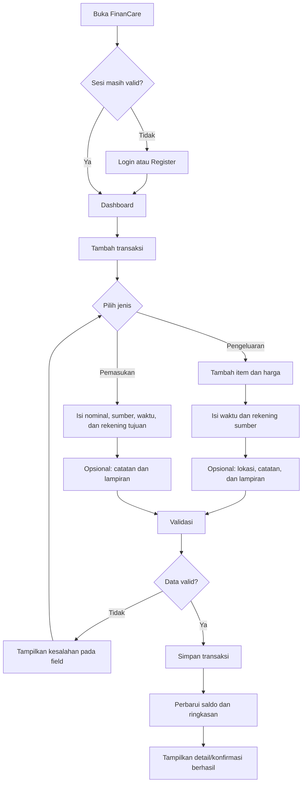
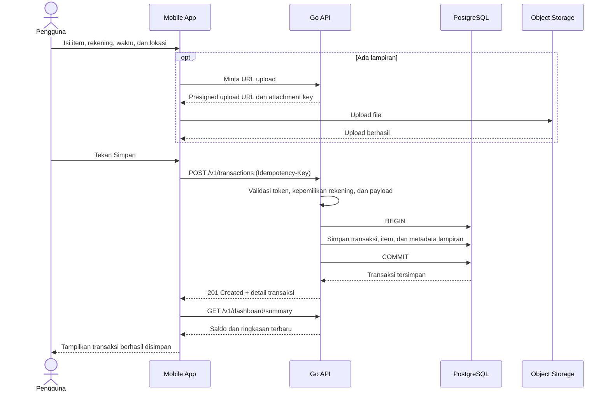
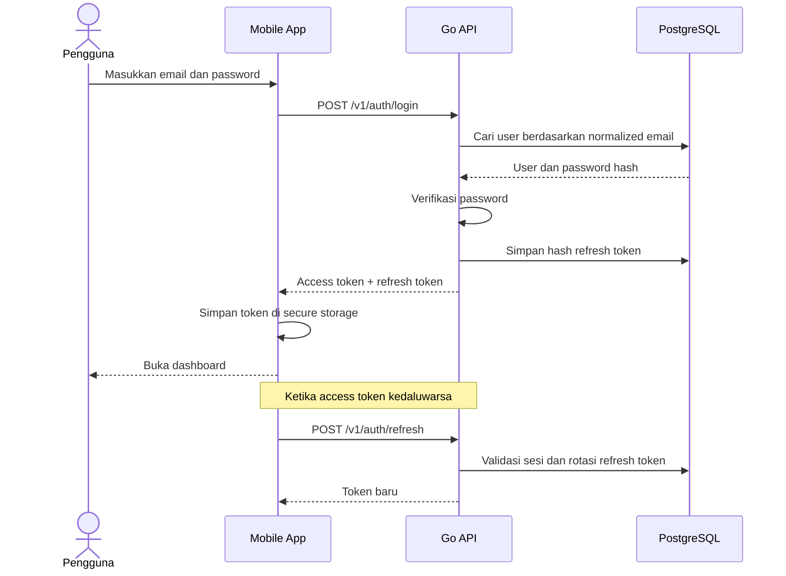
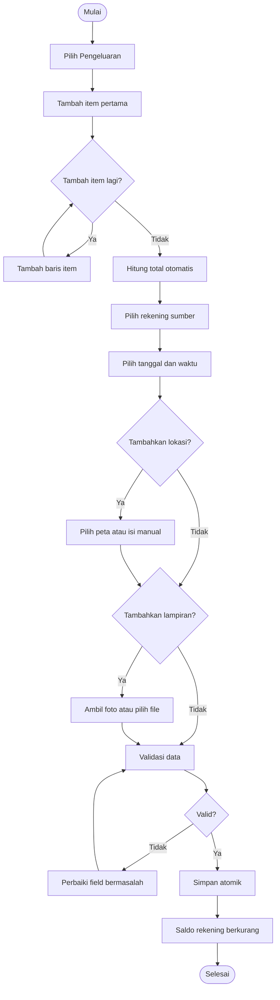
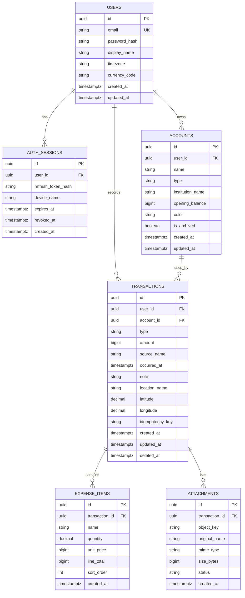
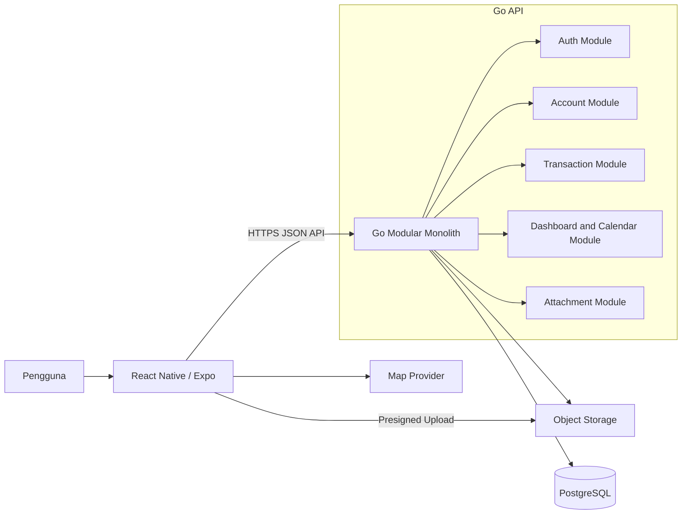

# Product Requirements Document — FinanCare

| Atribut | Nilai |
|---|---|
| Produk | FinanCare |
| Versi dokumen | 0.1 (Draft) |
| Tanggal | 15 Agustus 2026 |
| Platform | Aplikasi mobile Android dan iOS |
| Teknologi awal | React Native (Expo) dan Go |
| Status | Menunggu validasi product owner |

## 1. Ringkasan Produk

FinanCare adalah aplikasi pencatatan keuangan pribadi yang membantu pengguna mencatat pemasukan dan pengeluaran harian, mengetahui saldo keseluruhan dan saldo setiap rekening, serta memahami kondisi keuangan melalui riwayat dan kalender berindikator warna.

Pengguna dapat mencatat transaksi berdasarkan waktu terjadinya, memilih rekening yang menerima atau mengeluarkan dana, merinci item belanja, menyimpan lokasi transaksi, dan melampirkan bukti seperti nota atau struk.

### 1.1 Masalah yang Diselesaikan

Pengguna sering kehilangan konteks atas pergerakan uang karena:

- pencatatan manual terasa lambat dan rumit;
- uang tersebar di beberapa rekening dan kas;
- detail pembelian serta bukti transaksi tidak tersimpan bersama;
- pengguna sulit melihat hari dengan arus kas positif atau negatif;
- saldo aktual setiap rekening sulit dipantau secara konsisten.

### 1.2 Visi Produk

Menjadi aplikasi pencatatan keuangan pribadi yang cepat digunakan setiap hari, transparan dalam perhitungan saldo, dan mudah dipahami tanpa pengetahuan akuntansi.

### 1.3 Sasaran Produk

- Pengguna dapat membuat catatan pemasukan atau pengeluaran dalam waktu kurang dari 60 detik.
- Pengguna dapat melihat total saldo dan saldo per rekening.
- Pengguna dapat melihat ringkasan pemasukan dan pengeluaran per hari dan per bulan.
- Pengguna dapat menemukan kembali transaksi beserta item, lokasi, dan bukti transaksi.
- Data keuangan setiap pengguna tersimpan secara aman dan terisolasi.

### 1.4 Bukan Sasaran MVP

Fitur berikut tidak termasuk rilis pertama:

- sinkronisasi otomatis dengan bank;
- pembayaran atau transfer uang nyata;
- budgeting dan target tabungan;
- pencatatan utang/piutang;
- transaksi berulang otomatis;
- OCR atau ekstraksi otomatis dari struk;
- multi-currency dan konversi kurs;
- akun bersama atau keuangan keluarga;
- aplikasi web untuk pengguna akhir.

## 2. Pengguna Sasaran

### 2.1 Persona Utama

Individu yang memiliki satu atau beberapa sumber dana—misalnya uang tunai, BCA, BRI, atau dompet digital—dan ingin mencatat arus uang sehari-hari secara manual.

### 2.2 Kebutuhan Utama Pengguna

- Mencatat transaksi dengan cepat.
- Mengetahui uang saat ini berada di rekening mana.
- Mengetahui total pemasukan dan pengeluaran dalam periode tertentu.
- Mengetahui detail barang yang dibeli.
- Menyimpan bukti transaksi bila diperlukan.
- Melihat pola arus kas melalui kalender sederhana.

## 3. Ruang Lingkup dan Prioritas

Prioritas menggunakan klasifikasi berikut:

- **P0**: wajib tersedia untuk MVP.
- **P1**: penting, dapat masuk setelah MVP stabil.
- **P2**: pengembangan lanjutan.

| Modul | Kemampuan | Prioritas |
|---|---|---:|
| Autentikasi | Register, login, refresh sesi, logout | P0 |
| Rekening | Membuat dan mengelola Cash, rekening bank, atau dompet digital | P0 |
| Pemasukan | Nominal, sumber, tanggal/waktu, rekening tujuan, catatan, lampiran | P0 |
| Pengeluaran | Item dinamis, harga, tanggal/waktu, rekening sumber, lokasi, catatan, lampiran | P0 |
| Saldo | Total saldo dan saldo per rekening | P0 |
| Riwayat | Daftar dan detail transaksi, filter dasar | P0 |
| Kalender | Indikator hijau, merah, atau netral per hari | P0 |
| Profil | Informasi pengguna dan logout | P0 |
| Koreksi data | Edit dan hapus transaksi milik sendiri | P0 |
| Transfer internal | Memindahkan saldo antar-rekening tanpa mengubah total saldo | P1 |
| Kategori | Kategori pemasukan/pengeluaran yang dapat dikelola | P1 |
| Ekspor data | CSV/PDF | P1 |
| Anggaran | Budget per kategori/periode | P2 |
| OCR struk | Membaca item dan nominal dari foto | P2 |

## 4. Asumsi Produk untuk MVP

Asumsi berikut digunakan agar rancangan dapat dilanjutkan. Semua asumsi masih dapat diubah sebelum pengembangan backend dimulai.

1. Mata uang MVP adalah Rupiah (`IDR`) dan nilai uang disimpan sebagai bilangan bulat, bukan floating point.
2. Metode `cash` atau `debit` direpresentasikan oleh rekening yang dipilih. Rekening bertipe `CASH` berarti tunai; rekening bertipe `BANK` berarti sumber atau tujuan dana bank seperti BCA/BRI.
3. Nama bank tidak dibuat sebagai enum tetap. Pengguna dapat membuat rekening dengan nama dan institusi sendiri.
4. Total pengeluaran dihitung otomatis dari jumlah seluruh item dan tidak diinput ulang secara terpisah.
5. Lokasi pengeluaran bersifat opsional. Pengguna dapat memilih titik di peta atau mengisi nama lokasi secara manual.
6. Tanggal dan waktu transaksi dapat diubah, dengan nilai awal waktu saat transaksi dibuat.
7. Zona waktu awal pengguna adalah `Asia/Makassar`, tetapi disimpan sebagai preferensi pengguna. Timestamp disimpan dalam UTC.
8. Satu transaksi hanya menggunakan satu rekening pada MVP.
9. Saldo awal rekening diisi ketika rekening dibuat.
10. Transfer antar-rekening ditempatkan di P1 supaya alur utama MVP tetap berfokus pada pemasukan dan pengeluaran.

## 5. Kebutuhan Fungsional

### 5.1 Autentikasi dan Sesi

#### AUTH-01 — Registrasi

Pengguna dapat membuat akun menggunakan nama, email, dan password.

Kriteria penerimaan:

- email harus valid dan unik tanpa membedakan huruf besar/kecil;
- password minimal 8 karakter;
- password tidak pernah disimpan dalam bentuk teks asli;
- setelah registrasi berhasil, pengguna masuk ke aplikasi atau diarahkan ke login;
- pesan kesalahan tidak membocorkan informasi sensitif.

#### AUTH-02 — Login

Pengguna dapat login menggunakan email dan password.

Kriteria penerimaan:

- kredensial yang benar menghasilkan access token dan refresh token;
- kredensial salah menampilkan pesan umum;
- sesi dapat dipulihkan ketika aplikasi dibuka kembali selama refresh token masih valid.

#### AUTH-03 — Logout

Pengguna dapat keluar dari perangkat aktif.

Kriteria penerimaan:

- refresh token perangkat dicabut di server;
- token lokal dihapus dari secure storage;
- pengguna kembali ke halaman login.

### 5.2 Rekening dan Saldo

#### ACC-01 — Membuat Rekening

Pengguna dapat membuat rekening dengan data:

- nama rekening, contoh: Cash, BCA Utama, BRI;
- tipe: `CASH`, `BANK`, atau `EWALLET`;
- nama institusi, opsional untuk selain Cash;
- saldo awal;
- warna atau ikon, opsional.

#### ACC-02 — Melihat Saldo

Sistem menampilkan:

- total saldo seluruh rekening aktif;
- saldo setiap rekening aktif;
- waktu terakhir data diperbarui.

Rumus saldo rekening:

```text
saldo rekening = saldo awal + total pemasukan - total pengeluaran
```

Rumus total saldo:

```text
total saldo = jumlah saldo semua rekening aktif
```

Transaksi yang telah dihapus tidak masuk dalam perhitungan saldo.

#### ACC-03 — Mengubah dan Mengarsipkan Rekening

Pengguna dapat mengubah nama, institusi, warna, atau ikon rekening. Rekening yang sudah memiliki transaksi tidak boleh dihapus permanen, tetapi dapat diarsipkan.

### 5.3 Pemasukan

#### INC-01 — Membuat Pemasukan

Data wajib:

- nominal lebih besar dari nol;
- sumber pemasukan, contoh: Gaji, Freelance, Bonus;
- tanggal dan waktu;
- rekening tujuan.

Data opsional:

- catatan;
- satu atau beberapa lampiran.

Kriteria penerimaan:

- pemasukan yang berhasil langsung menambah saldo rekening tujuan;
- transaksi muncul pada riwayat dan kalender sesuai tanggal transaksi;
- tombol simpan tidak membuat duplikasi ketika ditekan berulang karena gangguan jaringan;
- nominal ditampilkan menggunakan format Rupiah.

### 5.4 Pengeluaran

#### EXP-01 — Membuat Pengeluaran

Data wajib:

- minimal satu item;
- setiap item memiliki nama, kuantitas lebih besar dari nol, dan harga satuan tidak negatif;
- tanggal dan waktu;
- rekening sumber.

Data opsional:

- nama lokasi;
- koordinat latitude dan longitude dari peta;
- catatan;
- satu atau beberapa lampiran.

Perhitungan:

```text
subtotal item = kuantitas × harga satuan
total pengeluaran = jumlah seluruh subtotal item
```

Kriteria penerimaan:

- pengguna dapat menambah dan menghapus baris item secara dinamis;
- total berubah langsung ketika kuantitas atau harga berubah;
- pengeluaran yang berhasil langsung mengurangi saldo rekening sumber;
- item, lokasi, dan lampiran tampil pada detail transaksi;
- aplikasi memberi peringatan jika saldo rekening akan menjadi negatif, tetapi kebijakan awal tetap mengizinkan penyimpanan agar catatan mencerminkan kondisi nyata.

### 5.5 Riwayat dan Koreksi Transaksi

#### TRX-01 — Riwayat

Pengguna dapat melihat transaksi miliknya, diurutkan dari waktu terbaru, serta memfilter berdasarkan:

- rentang tanggal;
- tipe pemasukan atau pengeluaran;
- rekening;
- kata kunci sumber pemasukan, nama item, atau catatan.

#### TRX-02 — Detail

Detail transaksi menampilkan seluruh data transaksi, termasuk item pengeluaran, rekening, waktu, lokasi, catatan, dan lampiran.

#### TRX-03 — Edit

Pengguna dapat mengubah transaksi miliknya. Perubahan nominal, item, atau rekening harus langsung tercermin pada saldo dan ringkasan periode terkait.

#### TRX-04 — Hapus

Pengguna dapat menghapus transaksi setelah konfirmasi. Penghapusan menggunakan soft delete agar audit dan pemulihan data masih memungkinkan di sisi server.

### 5.6 Dashboard dan Kalender

#### DASH-01 — Ringkasan

Dashboard menampilkan:

- total saldo saat ini;
- saldo setiap rekening;
- total pemasukan bulan berjalan;
- total pengeluaran bulan berjalan;
- transaksi terbaru;
- tombol utama untuk menambah pemasukan atau pengeluaran.

#### CAL-01 — Kalender Bulanan

Setiap tanggal memiliki indikator berdasarkan perbandingan total transaksi pada tanggal tersebut:

| Kondisi | Indikator |
|---|---|
| Pemasukan > pengeluaran | Hijau |
| Pengeluaran > pemasukan | Merah |
| Sama atau tidak ada transaksi | Netral/abu-abu |

Ketika tanggal dipilih, aplikasi menampilkan total pemasukan, total pengeluaran, selisih, dan daftar transaksi pada hari tersebut.

### 5.7 Lampiran

#### ATT-01 — Unggah Lampiran

Pengguna dapat mengambil foto dari kamera atau memilih media/file dari perangkat.

Aturan awal:

- maksimal 5 lampiran per transaksi;
- format gambar: JPEG, PNG, atau HEIC;
- format dokumen: PDF;
- ukuran maksimal 10 MB per file;
- file hanya dapat diakses oleh pemilik transaksi;
- lampiran dihapus dari akses aktif ketika transaksi dihapus.

### 5.8 Lokasi

#### LOC-01 — Memilih Lokasi

Untuk pengeluaran, pengguna dapat:

- mengizinkan aplikasi menggunakan lokasi saat ini;
- mencari lokasi;
- memilih titik pada peta;
- mengisi atau mengubah label lokasi secara manual;
- melewati lokasi tanpa menghambat penyimpanan transaksi.

Penolakan izin lokasi tidak boleh menghalangi fungsi pencatatan lainnya.

## 6. Alur Sistem dan Logika Bisnis

### 6.1 Flowchart Pencatatan Transaksi



### 6.2 Sequence Diagram — Membuat Pengeluaran



### 6.3 Sequence Diagram — Login dan Pemulihan Sesi



### 6.4 Activity Diagram — Pengeluaran



### 6.5 Aturan Bisnis Utama

| ID | Aturan |
|---|---|
| BR-01 | Semua resource wajib terikat pada `user_id`; user tidak dapat membaca atau mengubah data user lain. |
| BR-02 | Nilai uang disimpan sebagai integer satuan Rupiah menggunakan tipe 64-bit. |
| BR-03 | Jumlah pemasukan harus lebih besar dari nol. |
| BR-04 | Pengeluaran wajib memiliki minimal satu item. |
| BR-05 | Total pengeluaran selalu berasal dari penjumlahan subtotal item di server. Nilai total dari client tidak dipercaya. |
| BR-06 | Rekening yang digunakan transaksi harus aktif dan dimiliki pengguna. |
| BR-07 | Perhitungan saldo hanya menggunakan transaksi yang belum dihapus. |
| BR-08 | Edit atau hapus transaksi memperbarui hasil saldo dan agregasi kalender. |
| BR-09 | Tanggal kalender menggunakan zona waktu pengguna, bukan tanggal UTC mentah. |
| BR-10 | Operasi create transaksi bersifat idempotent melalui `Idempotency-Key`. |
| BR-11 | Lampiran baru dianggap sementara sampai terhubung ke transaksi yang valid. |
| BR-12 | Saldo negatif diizinkan dengan peringatan pada MVP. |

## 7. Perancangan Basis Data

### 7.1 ERD



### 7.2 Constraint dan Indeks Penting

- `users.email` unik setelah dinormalisasi ke huruf kecil.
- `accounts.user_id, accounts.is_archived` diberi indeks.
- `transactions.user_id, occurred_at DESC` diberi indeks untuk riwayat.
- `transactions.user_id, account_id, occurred_at` diberi indeks untuk saldo per rekening.
- `transactions.user_id, idempotency_key` unik ketika key tersedia.
- `transactions.type` hanya menerima `INCOME` atau `EXPENSE`.
- `accounts.type` hanya menerima `CASH`, `BANK`, atau `EWALLET` pada MVP.
- `amount >= 0`, `unit_price >= 0`, dan `quantity > 0` dijaga di database dan aplikasi.
- Item hanya boleh dimiliki transaksi bertipe `EXPENSE`.
- `source_name` wajib untuk `INCOME`; pengeluaran wajib memiliki minimal satu item melalui validasi service dalam satu database transaction.

### 7.3 Strategi Perhitungan Saldo

Pada MVP, saldo dihitung dari ledger transaksi agar tidak terdapat dua sumber kebenaran. Nilai `current_balance` tidak disimpan pada tabel rekening.

Untuk skala data yang lebih besar, agregasi dapat ditingkatkan menggunakan summary table atau materialized view, tetapi ledger transaksi tetap menjadi sumber utama.

## 8. Arsitektur Sistem

### 8.1 Arsitektur Tingkat Tinggi



### 8.2 Keputusan Arsitektur Awal

- Backend menggunakan modular monolith Go agar sederhana untuk dikembangkan dan di-deploy, tetapi batas modul tetap jelas.
- API menggunakan REST JSON dengan prefix `/v1`.
- PostgreSQL menjadi penyimpanan utama.
- Lampiran disimpan di object storage kompatibel S3; database hanya menyimpan metadata.
- Mobile berkomunikasi dengan server melalui HTTPS.
- Access token berumur pendek; refresh token dirotasi dan hash-nya disimpan di server.
- Secret/token mobile disimpan menggunakan secure storage perangkat.
- Upload file menggunakan presigned URL agar file besar tidak membebani API server.
- Map provider dibuat sebagai adapter sehingga dapat diganti tanpa mengubah domain transaksi.

### 8.3 Struktur Modul Backend yang Disarankan

```text
server/
├── cmd/api/
├── internal/
│   ├── auth/
│   ├── account/
│   ├── transaction/
│   ├── attachment/
│   ├── dashboard/
│   └── platform/
│       ├── database/
│       ├── storage/
│       └── http/
├── migrations/
└── api/
```

## 9. Kontrak API Awal

### 9.1 Autentikasi

| Method | Endpoint | Fungsi |
|---|---|---|
| `POST` | `/v1/auth/register` | Membuat user |
| `POST` | `/v1/auth/login` | Login |
| `POST` | `/v1/auth/refresh` | Rotasi token |
| `POST` | `/v1/auth/logout` | Mencabut sesi aktif |
| `GET` | `/v1/me` | Mengambil profil sendiri |
| `PATCH` | `/v1/me` | Mengubah profil/timezone |

### 9.2 Rekening

| Method | Endpoint | Fungsi |
|---|---|---|
| `GET` | `/v1/accounts` | Daftar rekening beserta saldo |
| `POST` | `/v1/accounts` | Membuat rekening |
| `GET` | `/v1/accounts/{id}` | Detail rekening |
| `PATCH` | `/v1/accounts/{id}` | Mengubah rekening |
| `POST` | `/v1/accounts/{id}/archive` | Mengarsipkan rekening |

### 9.3 Transaksi

| Method | Endpoint | Fungsi |
|---|---|---|
| `GET` | `/v1/transactions` | Riwayat dengan filter dan cursor pagination |
| `POST` | `/v1/transactions` | Membuat pemasukan/pengeluaran |
| `GET` | `/v1/transactions/{id}` | Detail transaksi |
| `PATCH` | `/v1/transactions/{id}` | Mengubah transaksi |
| `DELETE` | `/v1/transactions/{id}` | Soft delete transaksi |

Contoh payload pemasukan:

```json
{
  "type": "INCOME",
  "account_id": "018f...",
  "amount": 5000000,
  "source_name": "Gaji",
  "occurred_at": "2026-08-15T01:00:00Z",
  "note": "Gaji Agustus",
  "attachment_ids": []
}
```

Contoh payload pengeluaran:

```json
{
  "type": "EXPENSE",
  "account_id": "018f...",
  "occurred_at": "2026-08-15T05:30:00Z",
  "items": [
    {
      "name": "Kopi",
      "quantity": 2,
      "unit_price": 18000
    },
    {
      "name": "Roti",
      "quantity": 1,
      "unit_price": 12000
    }
  ],
  "location": {
    "name": "Kedai Contoh",
    "latitude": -8.65,
    "longitude": 115.22
  },
  "note": "Sarapan",
  "attachment_ids": []
}
```

Server menghasilkan `amount` pengeluaran sebesar `48000` dari item.

### 9.4 Dashboard, Kalender, dan Lampiran

| Method | Endpoint | Fungsi |
|---|---|---|
| `GET` | `/v1/dashboard/summary?month=2026-08` | Total saldo dan ringkasan bulanan |
| `GET` | `/v1/calendar?month=2026-08` | Agregasi harian kalender |
| `GET` | `/v1/calendar/2026-08-15` | Ringkasan dan transaksi suatu hari |
| `POST` | `/v1/attachments/upload-url` | Membuat tiket upload |
| `POST` | `/v1/attachments/{id}/complete` | Menandai upload selesai |
| `DELETE` | `/v1/attachments/{id}` | Menghapus lampiran milik user |

### 9.5 Format Respons dan Error

Respons sukses menggunakan data eksplisit. Respons error menggunakan format konsisten:

```json
{
  "error": {
    "code": "VALIDATION_ERROR",
    "message": "Data yang dikirim belum valid.",
    "fields": {
      "items.0.name": "Nama item wajib diisi."
    },
    "request_id": "req_..."
  }
}
```

Status utama:

- `200` untuk operasi berhasil;
- `201` untuk resource baru;
- `400` untuk payload tidak valid;
- `401` untuk sesi tidak valid;
- `403` untuk akses ditolak;
- `404` untuk resource tidak ditemukan atau bukan milik user;
- `409` untuk konflik seperti email sudah terdaftar;
- `413` untuk file terlalu besar;
- `429` untuk rate limit;
- `500` untuk kesalahan internal dengan `request_id`.

## 10. Desain UI/UX dan Prototyping

### 10.1 Prinsip Desain

- Mobile-first dan dapat digunakan dengan satu tangan.
- Aksi mencatat transaksi selalu mudah dijangkau.
- Nominal dan saldo memiliki hierarki visual paling kuat.
- Hijau dan merah tidak menjadi satu-satunya pembeda; selalu disertai ikon atau label agar aksesibel.
- Form menampilkan field secara progresif sesuai jenis transaksi.
- Pengguna selalu melihat total pengeluaran sebelum menyimpan.
- Izin kamera dan lokasi diminta hanya ketika fitur digunakan.

### 10.2 Struktur Navigasi

```text
Auth Stack
├── Login
└── Register

Main Tabs
├── Home
├── Kalender
├── Riwayat
└── Profil

Global Action
└── Tambah Transaksi
    ├── Pemasukan
    └── Pengeluaran
```

### 10.3 Daftar Layar MVP

| Layar | Isi Utama |
|---|---|
| Splash/Session Restore | Memeriksa sesi secara singkat |
| Login | Email, password, tautan register |
| Register | Nama, email, password, konfirmasi password |
| Home | Total saldo, saldo rekening, ringkasan bulan, transaksi terbaru |
| Pilih Jenis Transaksi | Pemasukan atau pengeluaran |
| Form Pemasukan | Nominal, sumber, waktu, rekening, catatan, lampiran |
| Form Pengeluaran | Item dinamis, total, rekening, waktu, lokasi, catatan, lampiran |
| Pemilih Rekening | Daftar rekening dan aksi tambah rekening |
| Pemilih Lokasi | Peta, pencarian, lokasi saat ini, label manual |
| Kalender | Bulan, indikator per tanggal, ringkasan tanggal terpilih |
| Riwayat | Filter dan daftar transaksi |
| Detail Transaksi | Seluruh detail serta aksi edit/hapus |
| Daftar Rekening | Saldo per rekening, tambah/edit/arsipkan |
| Profil | Identitas, zona waktu, logout |

### 10.4 Prototype Alur Utama

```text
Home
  → tombol “+”
  → pilih “Pemasukan” atau “Pengeluaran”
  → isi form sesuai jenis
  → tinjau total dan rekening
  → simpan
  → tampilkan status berhasil
  → kembali ke Home dengan saldo terbaru
```

### 10.5 State yang Wajib Didesain

Setiap layar penting harus memiliki rancangan untuk:

- loading;
- data kosong;
- berhasil;
- validasi field;
- kegagalan server;
- tidak ada koneksi;
- izin kamera/lokasi ditolak;
- rekening belum dibuat;
- retry tanpa membuat transaksi ganda.

## 11. Kebutuhan Nonfungsional

### 11.1 Keamanan dan Privasi

- Seluruh trafik produksi menggunakan HTTPS.
- Password di-hash menggunakan algoritma yang layak untuk password seperti Argon2id atau bcrypt dengan parameter yang ditinjau saat implementasi.
- Refresh token disimpan dalam bentuk hash di server dan secure storage di mobile.
- Query selalu dibatasi oleh user yang terautentikasi.
- URL lampiran bersifat private dan berumur pendek.
- Log tidak boleh memuat password, token, atau isi file.
- Endpoint autentikasi memiliki rate limiting.
- Data sensitif di backup secara terenkripsi sesuai kemampuan infrastruktur.

### 11.2 Performa

- Respons API non-upload ditargetkan p95 di bawah 500 ms pada beban MVP.
- Dashboard pertama ditargetkan tampil dalam 2 detik pada koneksi normal.
- Riwayat menggunakan cursor pagination dengan default 20 transaksi.
- Gambar dikompresi di client sebelum upload ketika memungkinkan.

### 11.3 Keandalan

- Pembuatan transaksi, item, dan relasi lampiran dilakukan atomik.
- Request create transaksi aman untuk retry melalui idempotency key.
- Database memiliki backup rutin dan prosedur restore yang diuji sebelum produksi.
- Migration database bersifat versioned dan dapat dijalankan otomatis pada deployment terkontrol.

### 11.4 Aksesibilitas dan Lokalisasi

- Area sentuh minimum mengikuti pedoman platform.
- Semua aksi utama memiliki accessibility label.
- Kontras teks dan indikator mengikuti WCAG AA sejauh relevan untuk mobile.
- Format nominal awal adalah Rupiah dan bahasa awal Bahasa Indonesia.
- Tampilan waktu menggunakan preferensi zona waktu pengguna.

### 11.5 Observability

- Setiap request memiliki `request_id`.
- Server mencatat structured log, latency, status code, dan error internal.
- Crash reporting mobile dan error monitoring backend dipasang sebelum beta.
- Metrik utama: error rate, latency, keberhasilan login, keberhasilan membuat transaksi, dan kegagalan upload.

## 12. Analitik dan Indikator Keberhasilan

Analitik harus menghindari pengiriman nominal, nama item, sumber pendapatan, catatan, lokasi presisi, atau isi lampiran.

| Metrik | Definisi Awal |
|---|---|
| Activation rate | Pengguna baru yang membuat rekening dan transaksi pertama |
| Transaction completion rate | Form transaksi dibuka lalu berhasil disimpan |
| Median time to record | Waktu median dari memilih jenis sampai transaksi tersimpan |
| Weekly active recorder | User yang mencatat minimal satu transaksi dalam 7 hari |
| 4-week retention | User aktif kembali pada minggu keempat |
| API error rate | Persentase request API yang gagal karena server |
| Upload success rate | Persentase lampiran yang selesai diunggah |

Target kuantitatif ditentukan setelah baseline dari uji beta tersedia.

## 13. Rencana Pengembangan

Tahapan berikut mempertahankan urutan kerja yang telah ditetapkan.

### Tahap 1 — Analisis Desain Sistem dan Spesifikasi

Output:

- PRD yang telah disetujui;
- keputusan final terkait asumsi dan pertanyaan terbuka;
- scope MVP dan backlog P1/P2;
- acceptance criteria setiap fitur;
- definisi keamanan, performa, dan observability.

Exit criteria: seluruh keputusan berisiko tinggi sudah disepakati dan tidak ada kontradiksi pada scope MVP.

### Tahap 2 — Perancangan Alur Sistem dan Logika Bisnis

Output:

- flowchart utama;
- sequence diagram autentikasi dan transaksi;
- activity diagram pemasukan/pengeluaran;
- katalog business rules;
- skenario error dan edge case.

Exit criteria: alur normal, error, edit, dan hapus dapat ditelusuri tanpa celah logika saldo.

### Tahap 3 — Perancangan Basis Data

Output:

- ERD final;
- data dictionary;
- constraint dan indeks;
- strategi migration, backup, dan restore;
- contoh seed data untuk development.

Exit criteria: skema mendukung semua acceptance criteria P0 dan perhitungan saldo telah diuji dengan contoh data.

### Tahap 4 — Perancangan Arsitektur Sistem dan API

Output:

- diagram arsitektur;
- spesifikasi OpenAPI;
- strategi autentikasi dan authorization;
- kontrak error dan pagination;
- keputusan object storage dan map provider;
- environment development, staging, dan production.

Exit criteria: mobile dan backend dapat dikembangkan paralel berdasarkan kontrak API yang sama.

### Tahap 5 — Desain UI/UX dan Prototyping

Output:

- information architecture;
- user flow;
- wireframe low fidelity;
- design system dasar;
- prototype interaktif high fidelity;
- usability testing minimal 5 calon pengguna;
- spesifikasi state loading, empty, error, dan permission.

Exit criteria: alur transaksi utama lolos usability test dan dapat diselesaikan tanpa bantuan fasilitator.

### Tahap 6 — Pengembangan

Urutan delivery yang disarankan:

1. fondasi repository, konfigurasi environment, CI, database, dan API skeleton;
2. autentikasi dan profil;
3. rekening dan saldo awal;
4. pemasukan, pengeluaran, item dinamis, edit, dan hapus;
5. dashboard, riwayat, filter, dan kalender;
6. lampiran dan lokasi;
7. hardening keamanan, observability, pengujian end-to-end, beta, dan release.

Definition of Done per fitur:

- acceptance criteria terpenuhi;
- unit/integration test relevan lulus;
- API terdokumentasi;
- loading, empty, error, dan retry state tersedia;
- tidak ada isu keamanan severity tinggi yang diketahui;
- lolos review dan pengujian pada Android serta iOS;
- observability yang relevan tersedia.

## 14. Strategi Pengujian

### 14.1 Unit Test

- perhitungan subtotal dan total pengeluaran;
- perhitungan saldo;
- warna kalender;
- validasi kepemilikan rekening;
- validasi tipe transaksi;
- normalisasi email dan token rotation.

### 14.2 Integration Test Backend

- register, login, refresh, dan logout;
- create/edit/delete pemasukan dan dampaknya pada saldo;
- create/edit/delete pengeluaran beserta item;
- isolasi data antar-user;
- idempotency create transaksi;
- attachment lifecycle;
- agregasi kalender berdasarkan zona waktu.

### 14.3 End-to-End Mobile

- user baru mendaftar, membuat rekening, dan mencatat transaksi pertama;
- pengguna membuat pengeluaran multi-item;
- pengguna menambah foto struk;
- pengguna memilih lokasi atau menolak izin lokasi;
- pengguna mengedit dan menghapus transaksi;
- pengguna melihat perubahan indikator kalender;
- pengguna logout dan login kembali.

## 15. Risiko dan Mitigasi

| Risiko | Dampak | Mitigasi |
|---|---|---|
| Saldo tidak konsisten setelah edit/hapus | Tinggi | Gunakan ledger sebagai sumber kebenaran dan transaksi database atomik |
| Double submit pada jaringan buruk | Tinggi | Idempotency key dan tombol dengan submitting state |
| Lampiran membebani server | Sedang | Direct upload dengan presigned URL dan batas ukuran |
| Kebocoran data antar-user | Tinggi | Ownership check terpusat dan integration test isolasi data |
| Perbedaan hari akibat zona waktu | Sedang | Simpan UTC, agregasi menggunakan timezone user |
| Pengguna menolak izin lokasi | Rendah | Lokasi opsional dan label manual |
| Daftar bank berubah atau tidak lengkap | Rendah | Gunakan rekening dinamis, bukan enum bank tetap |
| Scope terlalu besar untuk MVP | Sedang | Pertahankan P0 dan pindahkan transfer/OCR/budget ke backlog |

## 16. Pertanyaan Terbuka untuk Validasi

Keputusan berikut perlu dikonfirmasi sebelum Tahap 1 dinyatakan selesai:

1. Apakah saldo boleh negatif? Default PRD: boleh, dengan peringatan.
2. Apakah lokasi pengeluaran wajib? Default PRD: opsional.
3. Apakah dompet digital seperti GoPay/OVO masuk tipe rekening MVP? Default PRD: ya.
4. Apakah attachment mendukung PDF atau hanya foto? Default PRD: foto dan PDF.
5. Apakah transfer antar-rekening harus masuk MVP? Default PRD: P1 setelah MVP.
6. Apakah pengeluaran boleh memiliki satu item generik tanpa rincian? Default PRD: ya, minimal satu nama item seperti “Belanja bulanan”.
7. Apakah pengguna perlu memilih kategori transaksi pada MVP? Default PRD: tidak, kategori berada di P1.
8. Apakah verifikasi email dan reset password wajib untuk peluncuran pertama? Rekomendasi: wajib sebelum produksi publik, boleh ditunda pada prototype internal.
9. Apakah akun dan seluruh data dapat dihapus sendiri oleh pengguna? Rekomendasi: ya sebelum publikasi ke app store.
10. Apakah aplikasi harus tetap dapat mencatat transaksi saat offline? Default PRD: tidak pada MVP; aplikasi menampilkan error dan memungkinkan retry aman.

## 17. Kriteria Penerimaan MVP Secara Keseluruhan

MVP dinyatakan siap untuk beta ketika:

- user dapat register, login, mempertahankan sesi, dan logout;
- user dapat membuat minimal satu rekening dengan saldo awal;
- user dapat membuat, melihat, mengedit, dan menghapus pemasukan;
- user dapat membuat, melihat, mengedit, dan menghapus pengeluaran multi-item;
- saldo total dan per rekening selalu sesuai dengan ledger transaksi;
- kalender menampilkan indikator harian yang benar;
- riwayat dapat difilter berdasarkan periode, tipe, dan rekening;
- attachment dan lokasi dapat ditambahkan tanpa menjadi syarat penyimpanan transaksi;
- data dua user terisolasi melalui pengujian otomatis;
- alur utama berfungsi pada Android dan iOS;
- crash/error monitoring, backup, dan kebijakan privasi dasar tersedia untuk beta eksternal.

## 18. Persetujuan Dokumen

| Peran | Nama | Status | Tanggal |
|---|---|---|---|
| Product Owner |  | Belum disetujui |  |
| Engineering |  | Belum disetujui |  |
| UI/UX |  | Belum disetujui |  |

